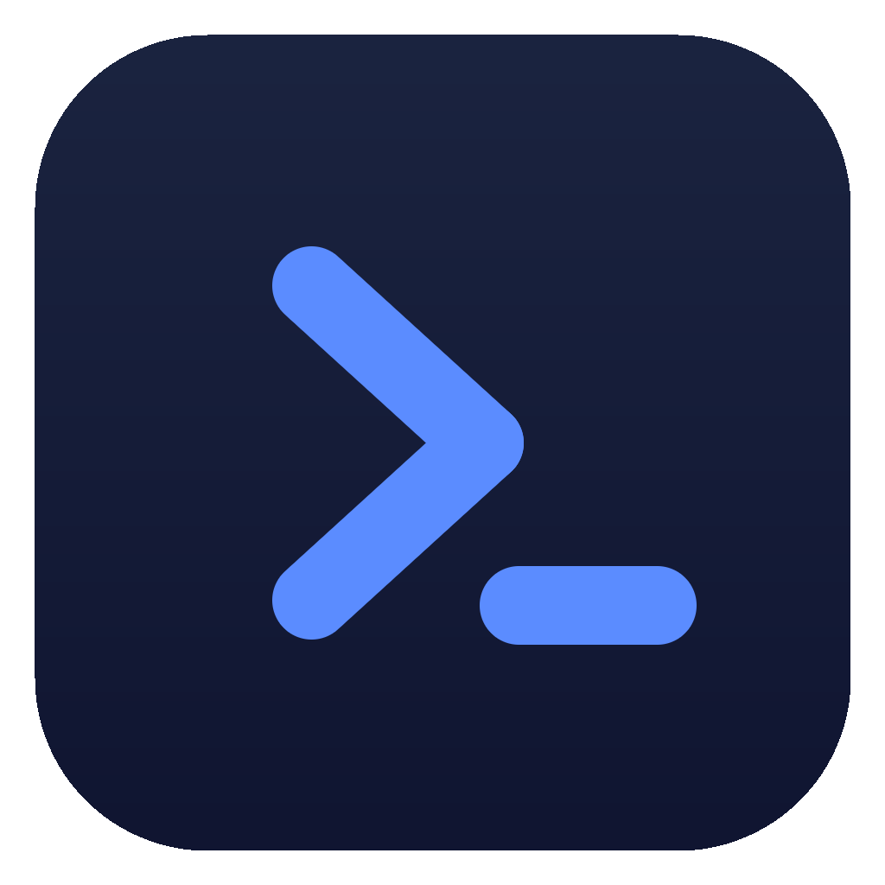

<div align="center">



# Portcode

### The AI code editor that codes for you — with any model.

**Describe what you want in plain language — Portcode's AI builds it for you.** Real software,
without writing the code yourself: you direct and review, the AI does the work.

<sub>Open source · native · runs locally · bring your own model. **Claude today; every model soon — early alpha** (see status below).</sub>

[](LICENSE)
[](https://github.com/porthex/portcode/actions/workflows/ci.yml)


</div>

Portcode is a fast, native **AI code editor** that does the coding for you. Describe what you
want in plain language — a feature, a fix, an entire small app — and the AI plans it, writes the
code, runs the commands, and shows you the result. You don't have to write code yourself: you
direct and review, and Portcode keeps you in command at every step.

It's for **anyone who wants to build software by directing an AI instead of writing it
themselves** — whether you've never written a line of code or you're a developer who'd rather
delegate the typing.

**You stay in control.** Every change lands as a reviewable diff behind a permission gate, so
nothing touches your files without your say-so — approve it, ask for changes, or roll it back.
Your keys stay in the OS keystore: never in plaintext, never phoned home.

Portcode's **mission** is bigger than any one model: _one app for every LLM_. Whatever you pay
for — an API key today, a subscription tomorrow — Portcode aims to be the single, fast, private
**home** you drive it from. We're not there yet (see the honest status below), and we'd rather
say so than oversell it.

> [!WARNING]
> **Early alpha — experimental.** Portcode works today with **Claude (Anthropic) only**, runs on
> **Windows only**, and is **desktop only**. You describe a task and the model makes the changes
> as reviewable diffs you approve at a permission gate. Multi-provider support, Linux, and
> **Phone Sync** are the mission and the roadmap — **not** shipped yet. Rough edges and breaking
> changes ahead. If that's exciting rather than disqualifying, welcome aboard.

<div align="center"><sub>▶︎ Demo GIF coming soon — see "Roadmap".</sub></div>

---

## Why Portcode

- **🤖 Delegate-first — the AI does the work for you.** This is Portcode's core identity:
  describe what you want in plain language and the model plans it, writes the code, and runs the
  commands — every change landing as a reviewable diff behind a permission gate that you approve.
  You direct and review; you don't have to write code.
- **🆓 Open source & free.** Apache-2.0. The whole editor — agent loop, tools, permission gate,
  UI — is in this repo, yours to read, fork, and extend.
- **⚡ Native & fast.** A Rust + Tokio core in a [Tauri](https://tauri.app) shell: the release
  binary is ~6 MB and idles around ~32 MB of RAM, reusing the WebView2 runtime already on
  Windows rather than shipping its own browser engine.
- **🛡️ Private & local by design.** Your key lives in **Windows Credential Manager**, file tools
  are sandboxed to your workspace, every mutating action is gated, and there is **zero
  telemetry** — nothing leaves your machine except the calls to the model you chose.
- **🧠 Codebase knowledge-graph aware.** An optional [graphify](GRAPHIFY.md) integration lets you
  (and your model) _query_ a knowledge graph of your repo instead of blindly grepping.
- **📱 Phone Sync — on the roadmap.** A fast engine to drive and continue your coding sessions
  from your phone. Vision-stage today, and a big reason Portcode is built on a lean, portable
  core.
- **🔑 Use any model, with your own keys.** Bring your own API key — Claude today, more providers
  planned. You pay the provider directly, at cost; Portcode takes no cut and adds no markup.

---

## Today vs. the roadmap

We think the fastest way to lose your trust is to blur what's real. So:

|                 | **Today (alpha)**                                                                         | **On the roadmap**                                                                   |
| --------------- | ----------------------------------------------------------------------------------------- | ------------------------------------------------------------------------------------ |
| **Models**      | Claude (Anthropic)                                                                        | OpenAI, Gemini, local models — _the mission: every LLM_                              |
| **Auth**        | Anthropic **API key** (BYOK), or **Claude Pro/Max** subscription sign-in _(experimental)_ | Subscription/account sign-in for other providers                                     |
| **OS**          | Windows 10/11                                                                             | Linux                                                                                |
| **Form factor** | Desktop                                                                                   | **📱 Phone Sync** — start a task at your desk, drive and continue it from your phone |

**Phone Sync** is the headline of where we're going: a fast, efficient engine to continue
your coding sessions from iOS/Android. It's vision-stage today (not built) — but it's the
reason Portcode is built on a lean, portable core from day one.

---

## Quickstart

> Portcode is built from source today — signed, prebuilt installers are on the roadmap.

### Prerequisites (Windows 10/11)

- **[Rust](https://rustup.rs)** (stable, **MSVC** toolchain — not GNU)
- **Visual Studio 2022 Build Tools** with the _Desktop development with C++_ workload
- **Node.js** (LTS) with **pnpm** via Corepack
- **WebView2 runtime** — preinstalled on Windows 11 (on Windows 10, install the Evergreen runtime)

### Run it

```powershell
git clone https://github.com/porthex/portcode
cd portcode

corepack enable        # makes the pinned pnpm available
pnpm install

# Option A — try the UI in your browser (mock agent, no Rust toolchain needed):
pnpm dev               # http://localhost:1420

# Option B — run the real native app (Rust core + window):
pnpm app:dev
```

In **preview mode** (`pnpm dev`) the UI is fully interactive and streams a _mock_ reply, so
you can explore the frontend without the Rust toolchain. The **native app** (`pnpm app:dev`)
talks to the real agent core.

### Build an installer

```powershell
pnpm app:build         # produces an NSIS installer under src-tauri/target/release/bundle
```

### First run

Open **Settings** (gear, bottom-left) → pick a model → describe a task in the composer. For
auth, choose one:

- **API key (BYOK)** — paste your **Anthropic API key** (stored in Windows Credential Manager,
  never on disk). Get one from the [Anthropic Console](https://console.anthropic.com/).
- **Claude Pro/Max subscription** _(experimental)_ — click **Sign in with Claude** to
  authenticate your existing subscription in the browser; Portcode then drives inference
  against it instead of a metered API key. When signed in, the subscription takes precedence
  over any API key. This uses an unofficial sign-in flow that may break if Anthropic changes
  their service — see [SECURITY.md](SECURITY.md#subscription-sign-in-experimental).

---

## Features

- **Streaming agent loop** over the Anthropic Messages API, with a live token + cost meter.
- **7 workspace-sandboxed tools** — `fs_read`, `list`, `glob`, `grep` (read-only) plus
  `fs_write`, `fs_edit`, `shell` (mutating, gated).
- **Permission gate** — `allow` / `ask` / `deny` (+ "always allow") for every mutating tool,
  enforced in the Rust core, not just the UI.
- **Reviewable diffs** — edits render as colorized unified diffs before they touch disk;
  chat code blocks are syntax-highlighted.
- **Persistent sessions** — SQLite (WAL) history that survives restarts, with a sidebar.
- **File explorer** — a lazy, `.gitignore`-aware tree; click a file to reference it.
- **Command palette** (`Ctrl+K`) and keyboard shortcuts (`Ctrl+N` new chat, `Ctrl+B` toggle
  explorer, `Ctrl+,` settings).
- **PowerShell-aware `shell`** — defaults to Windows PowerShell, with `cmd`/`pwsh` opt-in.

---

## How it works

Portcode is deliberately a small number of well-chosen parts, picked for
**reliability → speed → capability**:

- **Tauri v2** shell — a tiny binary that reuses the WebView2 already on Windows.
- **Rust + Tokio** core — the agent loop, streaming, tools, and the permission gate. No GC
  pauses, memory-safe, `unsafe` code denied at the crate level.
- **React + TypeScript + Vite + Tailwind** UI, with Zustand for state.
- **Windows Credential Manager** for secrets; **SQLite** for local session history.

```
portcode/
├─ src/            # React + TypeScript frontend (chat, sidebar, file explorer, settings)
├─ src-tauri/      # Rust core
│  └─ src/
│     ├─ agent.rs       # the agent loop
│     ├─ llm.rs         # Anthropic streaming client
│     ├─ tools.rs       # the 7-tool registry
│     ├─ permissions.rs # permission gate for mutating tools
│     ├─ db.rs          # SQLite session persistence
│     └─ secrets.rs     # Credential Manager wrapper
└─ docs/           # ROADMAP.md, and more
```

---

## Privacy & security

Portcode keeps your work on your machine:

- **Keys never hit disk in plaintext** — they live in the Windows Credential Manager.
- **Workspace sandbox** — file tools cannot read or write outside the folder you open.
- **Everything destructive is gated** — `fs_write`, `fs_edit`, and `shell` pass through the
  permission gate every time (until you choose "always allow").
- **Zero telemetry, no phone-home** — Portcode makes no network calls except to the LLM
  provider you configured.

Found a vulnerability? Portcode runs `shell` and holds API keys — please disclose privately
via [GitHub Private Vulnerability Reporting](https://github.com/porthex/portcode/security/advisories/new),
not a public issue. See [SECURITY.md](SECURITY.md).

---

## Knowledge-graph aware (graphify)

Portcode integrates [graphify](GRAPHIFY.md) — a code-knowledge-graph tool — so you and your
AI assistant can _query_ the codebase ("what connects the Tauri commands to the React
store?") instead of grepping file by file. It's an **optional** developer tool: install the
`graphify` CLI once, run `graphify .` at the repo root, and a queryable graph is generated
locally (the graph output isn't committed). See [GRAPHIFY.md](GRAPHIFY.md) for the full
workflow.

---

## Roadmap

The near-term engineering plan lives in [docs/ROADMAP.md](docs/ROADMAP.md). The bigger picture:

1. **More providers** — OpenAI, Gemini, and local models, toward the "every LLM" mission.
2. **Broader subscription support** — Claude Pro/Max sign-in has landed (experimental); more
   provider/account sign-in to follow.
3. **Linux** — Windows-first today; Linux is next.
4. **📱 Phone Sync** _(marquee)_ — a fast engine to drive and continue your coding sessions
   from your phone.
5. **Signed installers + auto-update** — so you don't have to build from source.

---

## Contributing

Contributions are welcome — Portcode is developed in the open. Start with
[CONTRIBUTING.md](CONTRIBUTING.md) for setup, the local quality gates, and a few
Windows-specific gotchas worth knowing before your first build.

- New contributors merge after a quick, one-time **[CLA](CLA.md)** signature (handled
  automatically by a bot on your first PR).
- Be excellent to each other — see the [Code of Conduct](CODE_OF_CONDUCT.md).
- Questions and ideas go in
  [GitHub Discussions](https://github.com/porthex/portcode/discussions), not the issue tracker.

**Branching model:** `main` is the active development branch — branch off it (`feat/…`,
`fix/…`, `docs/…`) and open your PR against `main`. Releases are cut from a separate
**`release`** branch and shipped as `vX.Y.Z` tags by maintainers. See
[docs/RELEASE.md](docs/RELEASE.md) for the release flow.

A great first contribution: **a new LLM provider.** It's the most direct way to push the
"every LLM" mission forward.

---

## About

Portcode is part of **[Porthex](https://github.com/porthex)**, a small toolset for native,
privacy-first developer tools. Licensed under **[Apache-2.0](LICENSE)**.

Built on the shoulders of [Tauri](https://tauri.app), [Rust](https://www.rust-lang.org),
[React](https://react.dev), and the [Anthropic API](https://www.anthropic.com).
